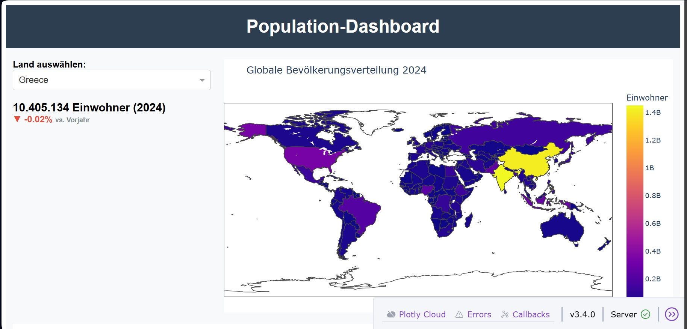
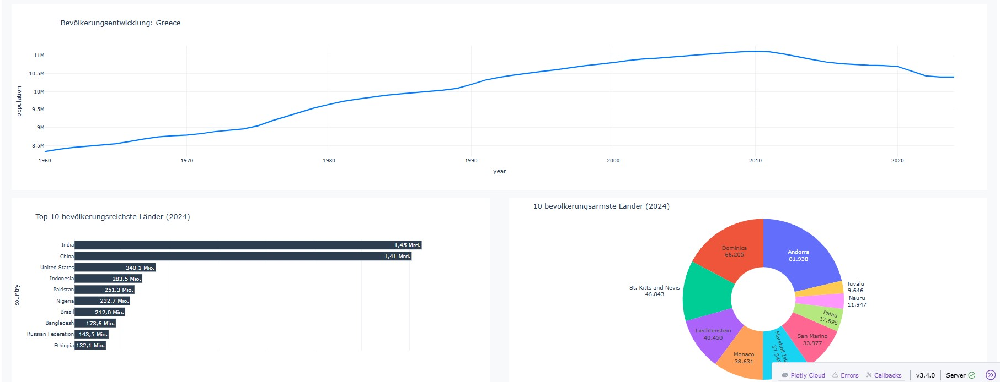

# Population Dashboard 🌍

Ein interaktives Dashboar zur Visualisierung der weltweiten Bevölkerungsentwicklung

## Features
* **Interaktive Weltkarte**: Zeigt die Bevölkerungsverteilung weltweit an.
* **Zeitreihen-Analyse**: Visualisierung der Einwicklung einzelner Länder über die Jahre seit 1960.
* **Top 10 Vergleiche**: Direkter Vergleich der bevölkerungsreichsten und -ärmsten Länder.
* **Wachstumsraten**: Anzeige der Veränderung zum Vorjahr in Prozent.

## Installation & Start

1. **Repository klonen**:
   `git clone https://github.com/schweRene/Populationdashboard.git`

2. **Virtuelle Umgebung erstellen & aktivieren**:
   `python -m venv .venv`
   `.venv\Scripts\activate` (Windows)

3. **Abhängigkeiten installieren**:
   `pip install pandas dash plotly`

4. **App starten**:
   `python app.py`

## Verwendete Technologien
* Python
* Plotly Dash
* Pandas (Datenverarbeitung)

## Screenshots

### Globale Übersicht

### Detaillierte Statistiken & Analyse
